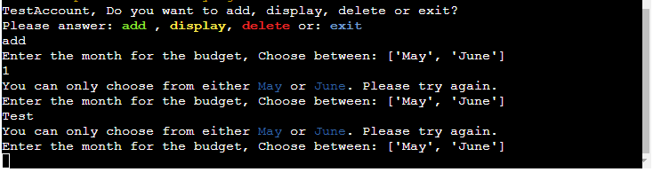

# Python project in a mock terminal for Code Institute

## General information

This is a project for a course in Python, Project Portfolio 3, for Code Institute by Gustaf Starhög.
The purpose of this project is to promote myself and show my skills in Python.

This project is a budget application that runs in a mock terminal in Heroku where you get to do the following things:
1. Create an account and a pincode.
2. Enter different expenses and their costs.
3. See your budget with calculations showing how much you have left to spend in total & per day of the remaining days of the month.
4. You can at anytime delete any data, or your entire account if you chose.

Link to the application: [BudgetApp](https://star-pro3.herokuapp.com/)

Image of the application: 

Disclaimer: I could not get the pyfiglet print to look the way I wanted it in the deployed terminal. I tried different fonts, sizes, widths and printing the words one by one on different lines without success. This is how it looks in the terminal on Gitpod:

Click here to see the image

---
## Table of Contents

 - ## [General Information](#general-information)

 - ## [Table of Contents](#table-of-contents-1)

 - ## [UX](#UX-1)

 - ## [Project Goals](#project-goals-1)

 - ## [User Stories](#user-stories-1)

 - ## [Flowchart](#Flowchart-1)

 - ## [General features](#general-features-1)
    
- ## [Testing](#testing-1)
    - ## [Code Validation](#code-validation-1)
    - ## [Testing User Stories](#testing-user-stories-1)
    - ## [Future improvements](#Future-improvements-1)
- ## [Bugs](#Bugs-1)

- ## [Libraries and Software](#Libraries-and-Software-1)

- ## [Final Result](#final-result-1)

- ## [Deployment](#deployment-1)

- ## [Github Pages](#github-pages-1)

- ## [Credits](#credits-1)
---
## UX
The UX is very limited due to the program running inside the mock terminal. However, some colors and icons were used to highlight certain information throughout the program to make it a little more pleasing to see and engage with.
The welcome message in the start of the program was used with pyfiglet, and although I did not manage to make it look the same on Heroku as in the gitpod terminal, I decided to leave it in the program.

--- 
## Project Goals
- Create a Budget app that showcases my skills in Python.
- Create a Budget app that is easy to understand and interact with.
- Create a Budget app that has real world usage for the user.
- Create a Budget app where the user has to choose a unique account name and pincode. 
- Create a budget app where the user can choose to only display saved data. 
- Create a Budget app where the user can delete data. 
- Create a Budget app where the user can delete their account. 
- Create a Budget app where all expenses are shown in a simple and understandable way.
- Create a Budget app that calculates how much money the user has left per day and in total for the rest of the month.
- Create a Budget app that saves all data to an external source.
- Create a Budget app that shows no errors.

---
# User Stories
### As a first time user... :
- I want to directly understand how the program works and what I need to fill in. 
- I want to choose my own Account name. 
- I should get the possibility to start over if the account name was already taken.
- I want to choose my own pincode. 
- I want to be able to set my total budget.
- I want to be able to choose the month for my budget. 
- I want to be able to add multiple expenses.
- I want to be able to categorize the expenses.
- I want to be able to see my finished budget. 
- I want to be able to delete data from my budget. 
- I want to be able to delete my account, should I desire. 

### As a returning user:
- I want to be able to login to my old account.
- I want to be able to see my existing data without entering new data.
- I want to be able to add new data to my budget.
- I want to be able to delete old data from my budget. 
- I want to be able to delete my account, should I desire. 

---
## Flowchart
In planning this project I started out with making a flowchart for what I wanted the project to contain. When making the project this was very helpfull on knowing where to start and what I needed to do.

I first made a flowchart in Lucidchart, however, I was not able to open it later again, even though it was visible in my account. So I created a new flowchart using https://miro.com/.

Click here to see the flowchart

(The flowchart does not represent the finished project)

---
## General features
- I thought of making a budget application due to the economic instability in the world right now. I wanted to make a simple budget app that works and shows how much you would have left after your expenses each month. 
- The budget app is linked with two google sheets through an API. 
    - The account name and pincode are saved together in a google sheet. 
    - The pincode is encrypted when saved to the google sheet. 
- In the data sheet, the following data is saved:
    - Account Name
    - Budget Month
    - Total Budget
    - Expense name
    - Expense amount
    - Transition type(Debit or Credit)
    - Todays date
    - Selected expense category(ex, Household or Transportation)
- If the user is a returning user and enters a new total budget amount, that amount will be the one used to do all calculations. I wanted the latest input of Total budget to be the one to use because there might be a change in the income since last time.
- The majority of the program is inbedded in a class called "BudgetApp", for me to be able to access and call different methods and information throughout the program.

Printscreen of the Class and docstring

---
### Welcome section
- When you start the program you are greeted with a pyfiglet print that says "Your budget app!".
- You are prompted to enter an Account name. If you are a returning user, you can choose your old Account name. If you are a new user, you can enter your Account name. If the Account name already exists, you will be told and you have the chance to restart and try another name. 
- If you are a returning user you enter your pincode, that is then matched against the google sheet's saved pincode and decrypts it and you can proceed.
- If you are a new user you must choose a pincode before proceeding. 
- If you enter a wrong pincode 3 times, the program shuts down as a precaution against bots trying to hack the pincode. 

Printscreen of the Welcome Section

---
### Total budget and month for the budget
- After your account has either been matched or created, you will see the options you have to choose from. You can either:
    - Add new data
    - Display old saved data
    - Delete data and/or your account
    - Exit the program
Depending on your choice different things will happen. 

    

    
Printscreen of the Options Section

    
    

---
### Adding new data:
- If you choose to add new data, the following inputs must be filled:
    - Month for the budget(You can only choose from the month you are currently in, or the next month. For example: "May" or "June")
    - Your total budget (For example "1000")
    - The expense type 1-5
        - 1 = Household
        - 2 = Food
        - 3 = Transportation
        - 4 = Other
        - 5 = Savings
    - The expense name (For example: Carpet)
    - Transaction type (Debit or Credit)
- After all of these inputs have been correctly filled, you can choose to enter more expenses if you want, or to proceed. If you choose to enter a new expense, the same inputs will be prompted until you don't want to add any more. 
- If you choose to not enter any more expenses, you can choose to either see your calculated budget for one of the valid months, or to exit the program.

Printscreen of the Expense types

---
### Viewing your budget. 
- When you choose to see your budget, you can choose from one of the 2 valid months (This or the next month).
- You will then see your Total budget and all expenses grouped together by expense type. The total budget used for the calulations, is the latest entered by the user.
- You will see how much money you have left in total, calulation in if you have paid anything by credit, that you need to save that money until the end of the month to afford the credit payment. 
- You will also see how much money you have to spend for each day that remains of the month. Therefore if you do your budget the 1st of the month, you will get a different result than if you do it on the 20th. 
- After you have viewed your budget, you can choose to either see the options again, or to exit the program. 

Printscreen of the budget 1

Printscreen of the budget 2

---
### Zero balance or not enough for the credit bill 
- If you have money left in your account, but not enough to pay the credit bill, a custom message will be printed:

    

    
Printscreen of no money for the credit bill

    
    

 - If you zero out your balance, a custom message will be printed:
    

    
Printscreen of zero balance

    
    

--- 
## Testing
- I have tested all inputs to make sure that only the desired inputs are allowed to be input by the user. 
- All testing printscreens can be found [here](https://github.com/gStarhigh/pro3/tree/main/documentation/testing)

### Account name
- If you are a new user and creates an account that does not exist, you can choose your pincode and your account is correctly saved to the google sheet. The account name cannot be empty or only contain numbers.
    

    
Printscreen of new user

    
    

    

    
Printscreen of a returning user

    
    

    

    
Printscreen of the wrong inputs

    
    

    

    
Printscreen of the Google sheet

    
    

### Pincode
- The pincode is saved with a different salt each time. Which means that if someone was to be able to crack the pincode of one user, it would not mean that all pincodes are leaked.
- The user has 3 tries to enter their pincode. Only 4 numbers are allowed, any other input will result in an error, and show the remaining tries.

Printscreen of wrong pincode

Printscreen of maximum tries

### Options
- The options for the program contains 4 different choices for the user, Add, Display, Delete or Exit.
- Any other input from the user will result in an error until the user enters valid information.

Printscreen of wrong input

### Valid Months
- To view a month in the program, the choosen month must have data. If you choose a month without any data, it will show an error and you can either choose another month, or exit the program. You cannot view historically entered data for past months. Only the current and next months are available.

Printscreen of the months without data

Printscreen of a month with data

Printscreen of a month with data

Printscreen of wrong input for the months

### Total budget
- The user must enter a total budget amount when adding new data. If the user has already entered a budget for the same month, the new total budget amount will override the old. The total budget can only contain numbers. 

Printscreen of wrong input for the budget

### Expense type
- The user can choose between 5 different expense types and these correspond with the users input 1 to 5. Any other number or letter by the user will result in an error and prompt the user to try again.

Printscreen of letter input for the expense type

Printscreen of wrong numeric input for the expense type

### Expense name and amount
- The expense input do allow both numbers and letters, as some items do have numbers in their name, for example "iPhone 14".
- The expense amount does only allow for whole numbers.

Printscreen of wrong input for the expense amount

### Transaction type
- The transaction type the user can choose is either "Debit" or "Credit". Depending on what the user has paid with, the calculations for the remaining of the budget differs as the user must save enough money to the end of the month to afford to pay the credit bill. 
- Any other input will result in an error.

Printscreen of wrong input for the transaction type

### Add another expense
- After adding an expense, the user has the option to either add another expense or to proceed and view the budget. If the user enters the wrong input, an error will appear and the user has to try again. 

Printscreen of wrong input for another expense

### Delete data
- The user has the option to delete an entire month, if they so choose. They can only delete data in the valid months span. After the program has looped through and checked the google sheet for data for the specific month, it will display the amount of rows that were deleted. Depending of the amount of rows that the user has in the specific month, the number of rows deleted will differ.

Printscreen of deleted rows

Printscreen of no deleted data

### Delete account
- If the user chooses to delete their account. All saved data will be deleted, along with the account name and pincode. The user will be asked one more time if they are certain that the account should be deleted. The action cannot be reversed. 

Printscreen of questions to delete account

Printscreen of google sheet deleted data

Printscreen of google sheet deleted account

### Restart or exit
- After the user has deleted information, they can choose to either restart the program or exit. 
- If the user enters wrong input, an error will occur and they will have to try again. 

Printscreen of wrong restart or exit input

---
### Code Validation
- The code has been passed trough the Code Institue python linter(PEP8) without any errors or warnings:

Click here to see the validation

---

## Testing User Stories
First time user:
1. Account name and pincode

| **Feature** | **Action** | **Expected result** | **Actual Result** |
|-------------|------------|---------------------|-------------------|
| Choose a username | Enter a username that does not exist | Check if the username exists | The username does not exist |
| Restart if username exist | Enter an existing username | Be able to start over | You can restart. |
| Enter a wrong pincode | Enter 4 letters | Error message should appear to tell the user to enter 4 letters  | Error message appeared and told the user to enter a 4 letters |
| Enter a wrong pincode  | Enter more or less than 4 numbers | Error message should appear to tell the user to enter 4 numbers  | Error message appeared and told the user to enter a 4 numbers |
| Enter a wrong pincode 3 times | Enter wrong pincode 3 times | Error message should appear and program shut down  | Error message appeared and program shut down |
| Enter a correct pincode  | Enter 4 numbers | The pincode and account name should be saved to the google sheet and program continue | The pincode and account name was saved, program continued |

2. Enter budget data

| **Feature** | **Action** | **Expected result** | **Actual Result** |
|-------------|------------|---------------------|-------------------|
| Choose budget month | Enter numbers instead of a month | Display error message that only the valid months are allowed | Error message was displayed |
| Choose budget month | Enter wrong month | Display error message that only the valid months are allowed | Error message was displayed |
| Choose budget month | Enter a valid month | No error should appear | No error occured |
| Set a total budget | Enter letters instead of numbers | Display error message that only numbers are allowed | Error message was displayed |
| Set a total budget | Enter only numbers | No error should appear | No error occured |
| Choose a category | Enter only letters | Display error message that you can only choose numbers: 1-5 | Error message was displayed |
| Choose a category | Enter numbers other than 1-5 | Display error message that you can only choose numbers: 1-5 | Error message was displayed |
| Choose a category | Enter numbers 1-5 | No error should appear | No error occured |
| Choose a expense name| Enter numbers as name | No error should appear | No error occured |
| Choose a expense name| Enter letters as name | No error should appear | No error occured |
| Choose a expense amount| Enter letters as amount | Display error message that only numbers are allowed | Error message was displayed |
| Choose a expense amount| Enter numbers and "," or "." as amount(Ex: 9,99) | Display error message that only numbers are allowed | Error message was displayed |
| Choose a expense amount| Enter only numbers| No error should appear | No error occured |
| Choose transaction type| Enter only numbers| Display error message with accepted inputs | Error message was displayed |
| Choose transaction type| Enter correct input | Display saved expense and ask if the user wants to add another expense | Expense was saved to google sheet and next question was provided |
| Add another expense | Enter numbers | Display error message | Error message was displayed |
| Add another expense | Enter letters but not correct input | Display error message | Error message was displayed |
| Add another expense | Enter "n" | Ask what month the user wants to display | The user was asked what month to display |
| Add another expense | Enter "y" | The user should be returned and can now add another expense | The user was returned and can now add another expense |

3. Display budget

| **Feature** | **Action** | **Expected result** | **Actual Result** |
|-------------|------------|---------------------|-------------------|
| Exit program | Enter "q" to exit | The program should exit | The program exited |
| Choose budget month | Enter numbers | Display error message and valid months | Error message occured |
| Choose budget month | Choose a invalid month | Display error message and valid months | Error message occured |
| Choose budget month | Choose a month without data | Display error message and let user choose another month | Error message occured and user could choose another month |
| Choose budget month | Choose a month with data | Display the total budget, all expenses, total credit/debit and all calulations correctly | All expenses and calulations of the budget appeared correctly |

4. Delete data and account

| **Feature** | **Action** | **Expected result** | **Actual Result** |
|-------------|------------|---------------------|-------------------|
| Delete data | Delete data in month without data | Display that no data has been deleted and display all options | Displayed message correctly and options was displayed |
| Delete data | Delete data in month with data | Display the amount of rows deleted display all options | Displayed amount of deleted rows and options was displayed |
| Delete account | Enter numbers instead of "yes" or "no" | Display error message | Error message occured |
| Delete account | Enter any letters instead of "yes" or "no" | Display error message | Error message occured |
| Delete account | Enter "no" | No data or account should be deleted and options displayed | No data or account was deleted and options were displayed |
| Delete account | Enter "yes" | All saved data to the account, and the account and pincode should be deleted | All saved data to the account and the account and pincode were deleted |

Returning user:
1. Login to existing account

| **Feature** | **Action** | **Expected result** | **Actual Result** |
|-------------|------------|---------------------|-------------------|
| Login to existing account  | Enter your saved username | Username should be matched with the database | The username was found and matched |
| Login to existing account  | Enter 4 numbers | The pincode and account name should be matched and program continue | The pincode and account name was matched, program continued |

2. Display saved data

| **Feature** | **Action** | **Expected result** | **Actual Result** |
|-------------|------------|---------------------|-------------------|
| Display saved data | Choose a month without data | Display error message and let user choose another month | Error message occured and user could choose another month |
| Display saved data | Choose a month with data | Display the total budget, all expenses, total credit/debit and all calulations correctly | All expenses and calulations of the budget appeared correctly |

3. Delete data and account

| **Feature** | **Action** | **Expected result** | **Actual Result** |
|-------------|------------|---------------------|-------------------|
| Delete data | Delete data in month without data | Display that no data has been deleted and display all options | Displayed message correctly and options was displayed |
| Delete data | Delete data in month with data | Display the amount of rows deleted display all options | Displayed amount of deleted rows and options was displayed |
| Delete account | Enter numbers instead of "yes" or "no" | Display error message | Error message occured |
| Delete account | Enter any letters instead of "yes" or "no" | Display error message | Error message occured |
| Delete account | Enter "no" | No data or account should be deleted and options displayed | No data or account was deleted and options were displayed |
| Delete account | Enter "yes" | All saved data to the account, and the account and pincode should be deleted | All saved data to the account and the account and pincode were deleted |

---
## Future improvements
- Be able to delete only a single expense from their budget. 
- Be able to view old budgets that contains data and not be restricted to valid months. 
- Be able to change information about an added expense, for example, from debit to credit.
- If I had more time I would look into "enums" to simplify the code even more.

---
## Bugs
- One problem that I haven't solved is the pyfiglet print with the welcome text. I could not get the pyfiglet print to look the way I wanted it in the deployed terminal. I tried different fonts, sizes, widths and printing the words one by one on different lines without success.

---
## Libraries and Software

### Libraries used:
- gspread - Used to control Google Sheets API by python.
- OAuthlib - Required to manage HTTP request and authenticate to Google Sheets API.
- bcrypt - Used to encrypt and decrypt the pincode.
- Datetime - Used to get the dates from the user. 
- Calendar - Used to get todays date from the user. 
- pyfiglet - Used to print ASCII welcome text.
- Colorama - Used to color terminal output text.

### Software used:
- Gitpod - Used for version control and to commit and push code to github.
- Github - Github is used to store the projects code after being pushed from gitpod. 
- Heroku - Used to deploy the project online.
- Miro.com - Used to create the flowchart.

---
## Final Result
- The final deployed project can be found [here.](https://star-pro3.herokuapp.com/)
- Link to the google sheets used to save all data and account information:
    - [Budget-Accounts](https://docs.google.com/spreadsheets/d/1mVIPszionmMB-rSFpCsI2O_zBnZJ-Dl0-9gJ68gOWtM/edit?usp=sharing)
    - [Budget-Data](https://docs.google.com/spreadsheets/d/1655jy4Ak4xUSzDcBgSW2vrKvznYpzRGiudOnwmD6pDY/edit?usp=sharing)

### Sample printscreens of the finished program below:

(All images can be found [Here](https://github.com/gStarhigh/pro3/tree/main/documentation/testing))

Printscreen 1

Printscreen 2

Printscreen 3

Printscreen 4

Printscreen 5

Printscreen 6

Printscreen 7

---
## Deployment
Creating the Heroku app

Steps (It's very important that these steps are followed in the correct order):
1.	Create an account on https://id.heroku.com/login
2.	If you have inputs in your code, you must insert the new line code for each input at the end for the mock terminal to display your inputs correctly. The code is “\n”.
3.	You need to enter information to your credentials.txt file, as Heroku uses this file to seach for dependencies when building your application in the mock terminal. You need to enter the following command in the command terminal: “pip3 freeze > requirements.txt” Be sure to spell the command exactly like this, and make sure that the requirements.txt file is named the same way. 
4.	Make sure to commit and push these changes before moving on.(See the "Github pages" for information about setting up your repository.)
5.	Go to Heroku’s daschboard.
6.	Click “Create a new app”
7.	Name your app (The app’s name must be unique) and choose a region
8.	Click Create app
9.	Go to the Settings tab when the app has been created.
10.	Go to the “Config Vars” (Click Reveal config vars)
11.	If you have protected any files in the gitignore file in your project we need to add config var settings for them to work(I have a file named creds.json file, I will add that one now). If you have a Google sheet API for example, follow these steps:
12.	In the field named “KEY” – enter “CREDS” (All capital letters) Then go into your creds.json file and copy the entire content. 
13.	Paste the copied content into the field named “value”
14.	Add a second KEY called “PORT” with the value “8000”.
15.	Next we need to scroll down to the buildpacks and click “Add buildpack”
16.	Click “python”, and click Save Changes. 
17.	Next we need to add another buildpack called “node.js”, click it, and then click Save Changes.
18.	Make sure that you do it in this order and the python buildpack is above the nodejs buildpack in the order. If they are in a different order, you can move python to the top after you have chosen both. 
19.	Click the “Deploy” section at the top next to the settings tab. 
20.	In the deployment method, select “GitHub”
21.	Confirm that you want to connect to GitHub, and enter your GitHub credentials(“If needed”).
22.	Now you can search for your repository that you want to deploy. 
23.	Enter your repositorys name and click “search”
24.	Then choose your repository and click connect
25.	Now you have 2 options, Automatic deploys, or Manually deploy.
26.	If you choose the automatic deploy, the code will automatically update each time you push to GitHub. Choose this option if your code is not yet finished. Otherwise you can choose Manual deploy, and click “deploy branch”
27.	When it’s done, you should see a message that says “Your app was successfully deployed” and you can click “view” to see your deployed app in the mock terminal. 
28.	You are all done and your project should now be uploaded to Heroku. 

---
## Github Pages
- This project was developed using Gitpod which I used to commit and push to GitHub using the terminal in GitPod.(Note that this project was deployed to Heroku and that those steps also must be followed.)
### Here are the steps to deploy a website to GitHub Pages from its GitHub repository:

- Log in to GitHub and locate the GitHub Repository.
- At the top of the Repository, locate the Settings button on the menu.
- Under Source, click the dropdown called None and select Main Branch.
- The page will refresh automatically and generate a link to your website.
### Forking the GitHub Repository
- By forking the GitHub Repository we make a copy of the original repository on our GitHub account to view and/or make changes without affecting the original repository by using the following steps...

- Log in to GitHub and locate the GitHub Repository.
- At the top of the Repository (not top of page) just above the "Settings" Button on the menu, locate the "Fork" Button.
- You should now have a copy of the original repository in your GitHub account.
### Making a Local Clone
- Log in to GitHub and locate the GitHub Repository
- Under the repository name, click "Clone or download".
- To clone the repository using HTTPS, under "Clone with HTTPS", copy the link.
- Open Git Bash
- Change the current working directory to the location where you want the cloned directory to be made.
- Type git clone, and then paste the URL you copied in Step 3. $ git clone https://github.com/YOUR-USERNAME/YOUR-REPOSITORY
- Press Enter. Your local clone will be created.
---
## Credits

- I want to thank my mentor Jack at Code Institute for continuing to push me in my projects and for his continued support. 

- Encrypt passwords in python:
https://www.makeuseof.com/encrypt-password-in-python-bcrypt/

- The flowchart was made at:
https://www.Miro.com/

- Information seaching:
https://www.google.com/ and https://www.w3schools.com/python/

---